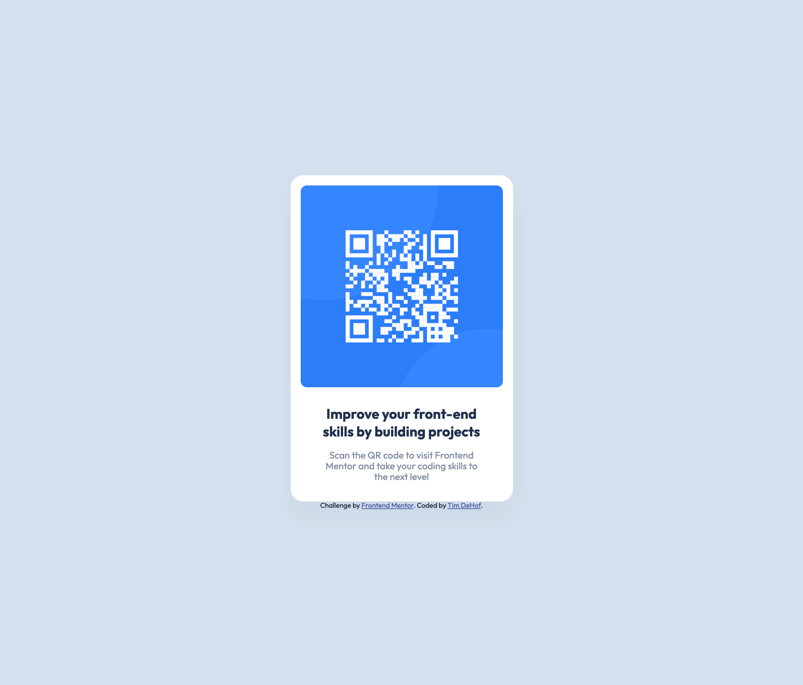

# Frontend Mentor - QR code component solution

This is a solution to the
[QR code component challenge on Frontend Mentor](https://www.frontendmentor.io/challenges/qr-code-component-iux_sIO_H).
Frontend Mentor challenges help you improve your coding skills by building
realistic projects.

## Table of contents

- [Overview](#overview)
  - [Screenshot](#screenshot)
  - [Links](#links)
- [My process](#my-process)
  - [Built with](#built-with)
  - [What I learned](#what-i-learned)
  - [Continued development](#continued-development)
  - [Useful resources](#useful-resources)
- [Author](#author)

## Overview

### Screenshot



### Links

- Solution URL: [Add solution URL here](https://your-solution-url.com)
- Live Site URL:
  [https://timdehof.github.io/qr-code-card/e](https://timdehof.github.io/qr-code-card/)

## My process

### Built with

- Semantic HTML5 markup
- CSS custom properties
- Flexbox
- CSS Grid
- Mobile-first workflow
- [React](https://reactjs.org/) - JS library
- [Vite](https://vitejs.dev/) - React development tool
- [Styled Components](https://styled-components.com/) - For styles

### What I learned

I used this challenge to practice working with Typescript and vite. I found it
very challenging to using vite for images. But I decided to just import images
as an url asset.

```typescript
import qrCode from "./assets/images/image-qr-code.png";
```

Also, I practiced using styled-components package for the css styles. I like
this css-to-js package because you write in javascript or typescript for the css
and don't have worry about writing some creative class name for tags you want to
style. Also, I like the ability to change the styling of the tag based on props
if you want to.

```typescript
<CodeContainer href='#'>
  
</CodeContainer>
```

```typescript
export const CodeContainer = styled.a`
  margin-bottom: 24px;
  aspect-ratio: 1:1;
  & img {
    display: inline-block;
    width: 100%;
    border-radius: 10px;
  }
`;
```

### Continued development

I would like to continue practicing using typescript and vite for small
challenges. I would also like to try using other libraries and frameworks like
Next.js, Angular, and svelte.

### Useful resources

- [Example resource 1](https://www.example.com) - This helped me for XYZ reason.
  I really liked this pattern and will use it going forward.
- [Example resource 2](https://www.example.com) - This is an amazing article
  which helped me finally understand XYZ. I'd recommend it to anyone still
  learning this concept.

**Note: Delete this note and replace the list above with resources that helped
you during the challenge. These could come in handy for anyone viewing your
solution or for yourself when you look back on this project in the future.**

## Author

- Website - [Tim DeHof](https://www.timdehof.dev/)
- Frontend Mentor -
  [@yourusername](https://www.frontendmentor.io/profile/yourusername)
- Twitter - [@yourusername](https://www.twitter.com/yourusername)

**Note: Delete this note and add/remove/edit lines above based on what links
you'd like to share.**
